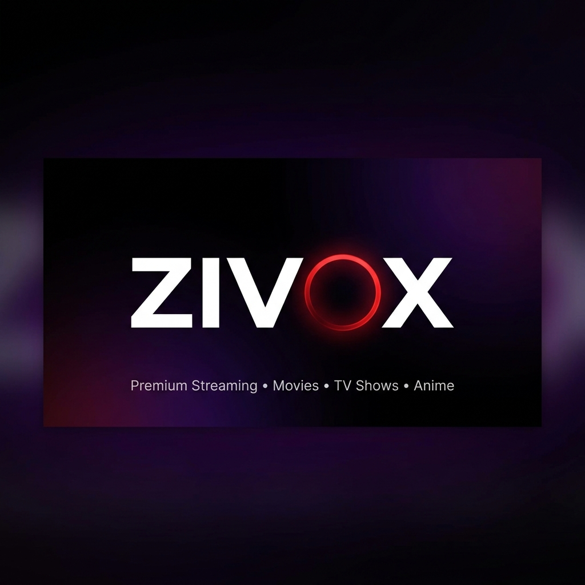

<div align="center">
  <a href="https://zivox-streaming.vercel.app">
    
  </a>

  <h1 align="center">ZIVOX — Premium Streaming Platform</h1>

  <p align="center">
    <strong>Watch Movies, TV Shows, and Anime Free in HD</strong>
    <br />
    <a href="https://zivox-streaming.vercel.app">Visit Website</a>
    ·
    <a href="https://github.com/lightning-bolt346/Personal-Movie-Platform/issues">Report Bug</a>
    ·
    <a href="https://github.com/lightning-bolt346/Personal-Movie-Platform/issues">Request Feature</a>
  </p>
</div>

<br />

<div align="center">
  <a href="https://zivox-streaming.vercel.app">
    
  </a>
</div>

## 🎬 About ZIVOX

**[ZIVOX](https://zivox-streaming.vercel.app)** is an open-source, highly optimized streaming platform built with Next.js 16. It offers a cinematic, ad-free experience to stream thousands of movies, TV shows, and anime series in HD quality. 

Designed for speed, SEO, and user experience, ZIVOX rivals premium streaming services with its dynamic dark UI and robust feature set.

### 🌟 Key Features

- **📺 Vast Library:** Stream the latest and greatest movies, trending TV shows, and top-rated anime.
- **⚡ 15+ Streaming Servers:** Automatic source testing ensures you always get the best quality stream without buffering.
- **🛡️ Sandbox Protection:** Built-in pop-up interceptors and click shields keep your viewing experience clean, safe, and ad-free.
- **📱 PWA & Mobile Optimized:** Fully responsive design. Install it directly to your home screen as a Progressive Web App.
- **🎬 Auto-Play Next:** Seamlessly binge-watch TV shows.
- **⭐ Watchlist & History:** Saves your viewing progress and favorites locally in your browser—no account required.
- **🔎 Advanced Search & Filters:** Search for actors, genres, years, or titles to find exactly what you want.

---

## 🚀 Tech Stack

ZIVOX is engineered for high performance and top-tier SEO:

- **Framework:** [Next.js 16 (App Router)](https://nextjs.org/)
- **Styling:** [Tailwind CSS](https://tailwindcss.com/)
- **Data/API:** [TMDB API](https://www.themoviedb.org/) for metadata, posters, and cast.
- **Media Sources:** CineSrc and various multi-server streaming proxies.
- **Icons:** [Lucide React](https://lucide.dev/)
- **Deployment:** [Vercel](https://vercel.com/)

---

## 🛠️ Run Locally

Want to host your own instance or contribute? Here is how to get started:

### Prerequisites
- Node.js 18.x or later
- A free TMDB API Key

### Installation

1. **Clone the repository**
   ```bash
   git clone https://github.com/lightning-bolt346/Personal-Movie-Platform.git
   cd Personal-Movie-Platform
   ```

2. **Install dependencies**
   ```bash
   npm install
   ```

3. **Environment Variables**
   Create a `.env.local` file in the root directory and add your API keys:
   ```env
   NEXT_PUBLIC_APP_URL="http://localhost:3000"
   TMDB_API_KEY="your_tmdb_api_key_here"
   ```

4. **Run the development server**
   ```bash
   npm run dev
   ```

5. **Open the app**
   Visit `http://localhost:3000` in your browser.

---

## 📈 SEO & Architecture

ZIVOX implements aggressive 2026 SEO best practices to rank high on Google and AI search engines (ChatGPT, Perplexity):
- **Server-Side Rendering (SSR)** for all media pages.
- **Programmatic SEO** with dynamic `/genre`, `/year`, and `/search` routes.
- **JSON-LD Schema Markup** (`VideoObject`, `WebSite`, `FAQPage`, `CollectionPage`).
- **`llms.txt` integration** for AI crawler optimization.
- Auto-generated `sitemap.xml` scaling to 80+ critical routes.

---

## 📜 Disclaimer

ZIVOX does not host any media files on its own servers. All content is provided by non-affiliated third parties. This project is intended for educational purposes.

## 🤝 Contributing

Contributions, issues, and feature requests are welcome! Feel free to check the [issues page](https://github.com/lightning-bolt346/Personal-Movie-Platform/issues).

<div align="center">
  <p>Built with ❤️ by the ZIVOX Team.</p>
</div>
